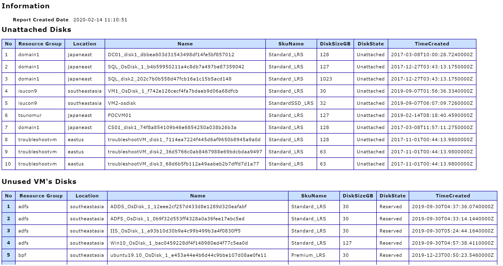

# azureadvisor
Advisor for Azure environment

# Description
`azureadvisor` is a tool to list unused resources and help optimize costs.

# Features
## Disk
- Unattached Disks - This managed disk is not attached to any VMs.
- Unused VM's Disks - This managed disk is connected to unused VM that is no CPU Utilization in month.

## VM
- Running VM - This VM has been used within one month.

## HDInsight
- Unused HDInsight cluster - This HDInsight cluster has not had a Gateway Request within one month.

# Usage
```bash
# You need login and set target subscription.
az login
az account set --subscription <Your subscriptionID>
# Execute command
./azureadvisor --subscriptionID <Your subscriptionID> disk 
```

## Help
```bash
NAME:
   advisor - Azure Advisor

USAGE:
   azureadvisor [global options] command [command options] [arguments...]

COMMANDS:
   disk       Advisor for Disk
   vm         Advisor for VM
   hdinsight  Advisor for HDInsight
   help, h    Shows a list of commands or help for one command

GLOBAL OPTIONS:
   --subscriptionID value
   --help, -h              show help (default: false)
```

# Sample
Please see sample directory.

## Image
